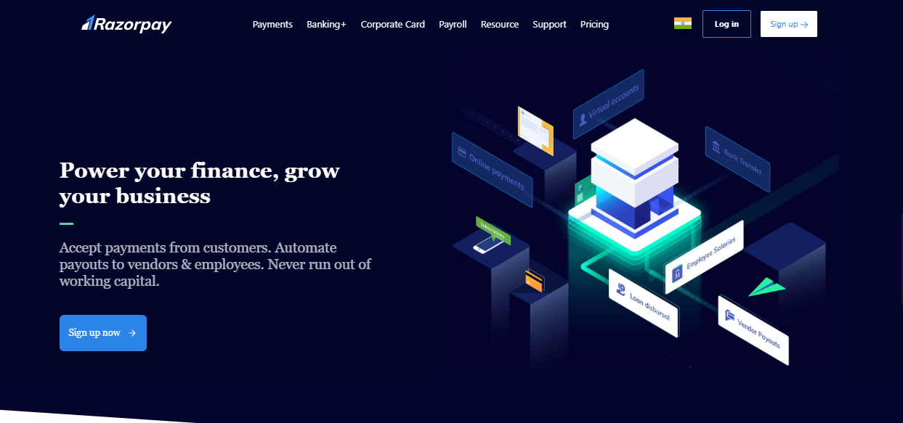

<h2>Landing page</h2>



# For setup 
<h1>First fork the repo or clone the repo.</h1> 
<h2>Use 'npm install' or 'npm i' to install all dependency.</h2>

<h2>After downloading all dependency use 'npm run start' or 'npm start' to start execution.</h2>

# See output
``` http://localhost:5173/ ``` <span>in this Url.</span>